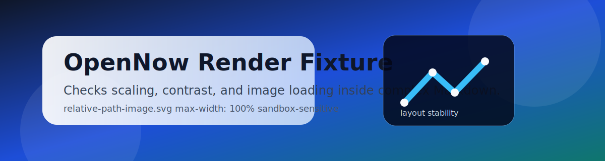

# Image Top Fixture

This file exists to verify local image loading before any scrolling or outline interaction.

Inline context after the images should still render normally, with **bold text**, `inline code`, and a [remote link](https://example.com).
