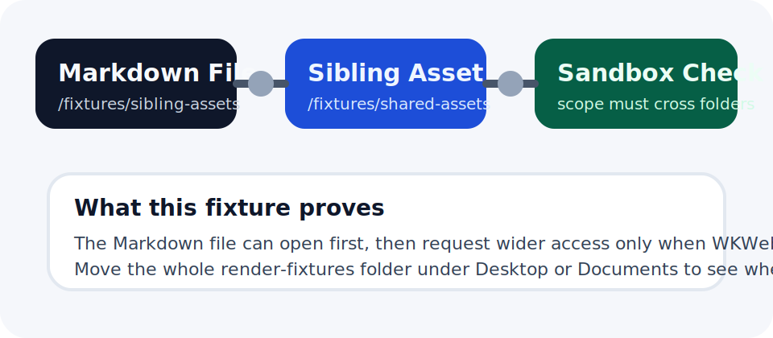

# Sibling Asset Access Fixture

This file is intentionally placed in `sibling-assets/` while its image lives in the sibling folder `../shared-assets/`.

Use it to test the exact path you asked for:

1. Open this Markdown file directly.
2. Let the reader try to render the sibling image below.
3. Observe what happens:
   - If the whole fixture tree is inside a macOS protected location like `Desktop` or `Documents`, macOS may raise its own `Files & Folders` prompt first.
   - If it is in a normal unprotected location, there should be no system TCC prompt; OpenNow should then fall back to folder picking only if sandbox scope is insufficient.

## Cross-folder image

## Notes

- The Markdown file path and the image path are different directories on purpose.
- This is the real regression probe for "open `A.md`, then touch a sibling resource later".
- If this renders without any prompt, you are probably outside the sandbox or already hold a wider bookmark.
