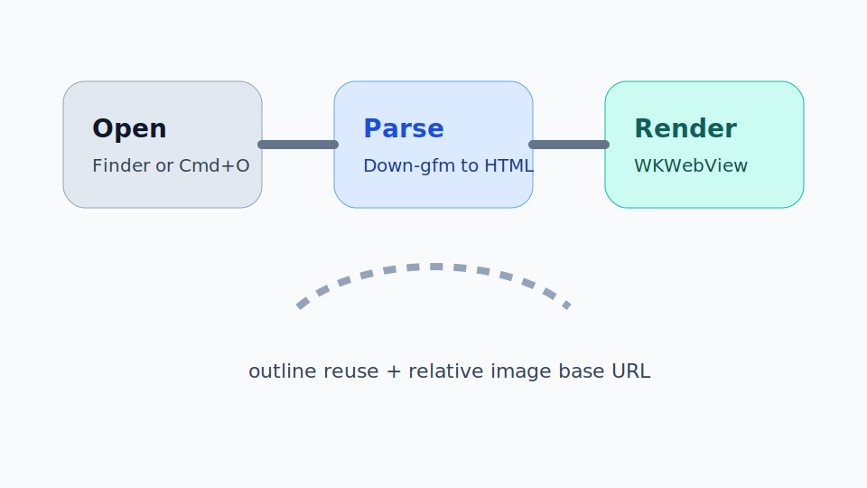

# Table Top Fixture

This file exists to verify table rendering without any scrolling.

## Alignment Table

| Column | Left | Center | Right |
| :-- | :-- | :--: | --: |
| Row 1 | plain text | centered value | 42 |
| Row 2 | `inline code` | **bold** | 9001 |
| Row 3 | very long text that should wrap rather than blow out the whole table width | icon-like text | 123456789 |

## Wide Table

| Section | Purpose | Main Risk | Mitigation | Notes | Owner | Status |
| --- | --- | --- | --- | --- | --- | --- |
| Launch shell | Show UI first | White screen before interactivity | Initialize shell before document load | This is the non-negotiable rule | App layer | Stable |
| Markdown render | Convert source to HTML | Main-thread parsing | Parse off main thread and inject HTML later | Reuse outline extraction work | Renderer | Stable |
| Relative images | Show local assets | Sandbox tree access missing | Authorize the inferred tree root such as Desktop or a repo root | Keep prompts rare by reusing root bookmarks | Access layer | Watching |
| WebView init | Host the document | Cold creation cost | Keep placeholder path available if profiling proves it necessary | Evidence first, tricks second | Reader | Watching |

## Mixed Content Table

| Visual | Text |
| --- | --- |
|  | This is a brutal but useful case: an image embedded inside a table cell next to dense explanatory text. If your CSS is sloppy, this turns into a mess quickly. |
